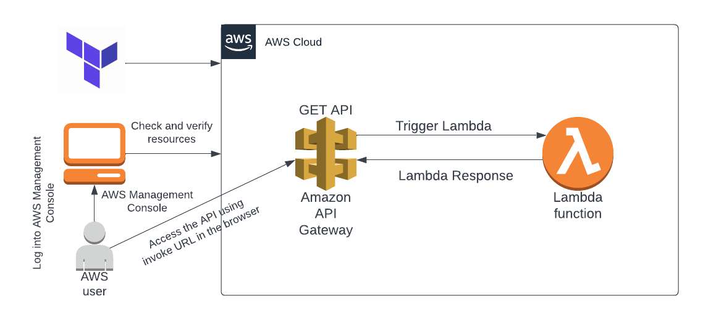

# Terraform Project

This repository contains Terraform code to deploy AWS resources.

## Usage
1. Initialize Terraform:
   ```bash
   terraform init
# Terraform Project

# Serverless API with Terraform 🚀

This project demonstrates how to provision a **serverless REST API** on AWS using **Terraform**.  
The API Gateway is integrated with a Lambda function to handle HTTP requests, making the application **scalable, cost-efficient, and fully serverless**.

---

## 📌 Architecture

 

**Components:**
- **API Gateway** – Exposes REST endpoint
- **Lambda Function (Python 3.8)** – Handles requests
- **IAM Role** – Grants Lambda execution permissions
- **Terraform** – Infrastructure as Code (IaC) for automated deployment

---

## ⚙️ Deployment Steps

Clone the repository:
```bash
git clone https://github.com/GokhanSaygin/Serverless-api-terraform.git
cd Serverless-api-terraform


Retrieve the API endpoint (from outputs or state file) and test it:

curl https://<api_id>.execute-api.<region>.amazonaws.com/<stage>/<resource>

🎯 Real-World Use Cases

This architecture is commonly used for:

Event-driven applications → Trigger Lambda from API calls

Microservices backends → Lightweight APIs without managing servers

Prototyping → Quick, cost-effective serverless solutions

💡 Example: A simple student management system where the API receives student data (via POST) and stores it in DynamoDB.

🧰 Tools & Technologies

Terraform v1.7+

AWS API Gateway

AWS Lambda (Python 3.8)

IAM Roles & Policies

GitHub for version control

📝 Lessons Learned

Building a serverless API from scratch using Terraform.

Connecting API Gateway → Lambda through Infrastructure as Code.

Using .gitignore properly to exclude sensitive files (.terraform/, *.tfstate, *.tfvars).

curl https://<api_id>.execute-api.<region>.amazonaws.com/<stage>/<resource>


👤 Author

Ahmet Gökhan Saygın

